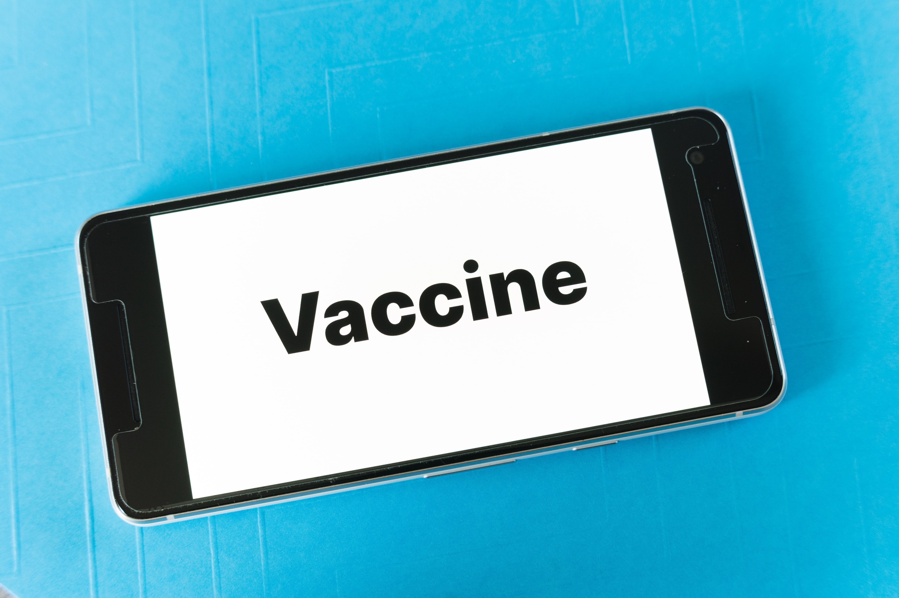

# Sentiment Analysis: Covid Vaccine on Twitter
**Author**: [David Bruce](mailto:david.bruce14@gmail.com)

Image source: Unsplash

## Overview
In late January 2020, the first known case of the novel Coronavirus was documented in the United States, and on December 14th of the same year, an FDA emergency approved vaccine produced by pharmaceuticals manufacturer Pfizer was given to its first non-trial patient, a healthcare worker in New York. The vaccine was created in record time, less than a year after the discovery of the virus, and after the deaths of over 300,000 Americans, and over 1,000,000 worldwide. However, the world seems divided into those who are ready to receive the inoculation, and those who aren't. According to the CDC, the amount of people who need protection from a specific disease varies by disease, and the New York Times states "Public health officials estimate that 70 to 75 percent of the population needs to be vaccinated before people can start moving freely in society again" ([NY Times](https://www.nytimes.com/2020/12/14/well/live/covid-vaccine-questions.html#link-4355ea14)). And in the United States, the most recent Gallup poll released November 17th suggests that still only 58% of Americans say they would take a COVID-19 vaccine [Gallup](https://news.gallup.com/poll/325208/americans-willing-covid-vaccine.aspx). 

While vaccines and vaccinations have been a hotly debated political topic for many in the US, diving into the realm of medical freedoms and the measures available to a government in order to protect its citizens from public health concerns, none have been as widespread and polarized as COVID-19. So when a global pandemic and a record breaking vaccine occur in the same year as one of the country's most contentious and hotly debated presidential elections, sentiments are sure to be high, and not least of all on Twitter. What is at the core of this divide? And how might government officials and medical professionals be able to address the lack of faith in a vaccine in the current cultural moment? These are the questions I hope to address with natural language processing (NLP) and machine learning classification algorithms.

## Business Problem

Using the data available from Twitter, I wanted to use NLP techniques to analyze tweet sentiment and help find insights as to how people are feeling about a COVID-19 vaccine. Sentiment analysis is a difficult task for machines to perform because there are many hurdles to overcome. Even when a text is being classified by humans as positive, negative, or neutral in sentiment, there is a significant amount of subjectivity and nuance that goes into that judgment on top of years of communicating as a human. Linguists and data scientists have made incredible progress in the realm of NLP in the last decade, and still sentiment analysis proves full of unique challenges. It is difficult to train a machine to detect sarcasm or cultural differences when speaking the same language. This should not deter us from trying, and my case I want to classify tweets about COVID-19 from the last 10 months as either positive, negative, or neutral in their sentiment, and perhaps more importantly learn what is distinct about the language of each of these classes

## Data & Methods

Twint, VADER, Python, SpaCy, NLTK, Scikit Learn

Lorem ipsum dolor sit amet, consectetur adipiscing elit, sed do eiusmod tempor incididunt ut labore et dolore magna aliqua. Ut enim ad minim veniam, quis nostrud exercitation ullamco laboris nisi ut aliquip ex ea commodo consequat. Duis aute irure dolor in reprehenderit in voluptate velit esse cillum dolore eu fugiat nulla pariatur. Excepteur sint occaecat cupidatat non proident, sunt in culpa qui officia deserunt mollit anim id est laborum.

## Final Model Performance

"Lorem ipsum dolor sit amet, consectetur adipiscing elit, sed do eiusmod tempor incididunt ut labore et dolore magna aliqua. Ut enim ad minim veniam, quis nostrud exercitation ullamco laboris nisi ut aliquip ex ea commodo consequat. Duis aute irure dolor in reprehenderit in voluptate velit esse cillum dolore eu fugiat nulla pariatur. Excepteur sint occaecat cupidatat non proident, sunt in culpa qui officia deserunt mollit anim id est laborum."

"Lorem ipsum dolor sit amet, consectetur adipiscing elit, sed do eiusmod tempor incididunt ut labore et dolore magna aliqua. Ut enim ad minim veniam, quis nostrud exercitation ullamco laboris nisi ut aliquip ex ea commodo consequat. Duis aute irure dolor in reprehenderit in voluptate velit esse cillum dolore eu fugiat nulla pariatur. Excepteur sint occaecat cupidatat non proident, sunt in culpa qui officia deserunt mollit anim id est laborum."

"Lorem ipsum dolor sit amet, consectetur adipiscing elit, sed do eiusmod tempor incididunt ut labore et dolore magna aliqua. Ut enim ad minim veniam, quis nostrud exercitation ullamco laboris nisi ut aliquip ex ea commodo consequat. Duis aute irure dolor in reprehenderit in voluptate velit esse cillum dolore eu fugiat nulla pariatur. Excepteur sint occaecat cupidatat non proident, sunt in culpa qui officia deserunt mollit anim id est laborum."

## Recommendations

## Next Steps
-
-
-

## Repository Contents
- `data`: Folder contains data used in notebooks, mostly hidden in .gitignore due to file sizes
- `src`: Folder contains .py files
- `images`: Folder contains graphs from EDA & modeling process
- `.gitignore`: Contains hidden files including the original dataset
- `presentation.pdf`: Image of slide deck
