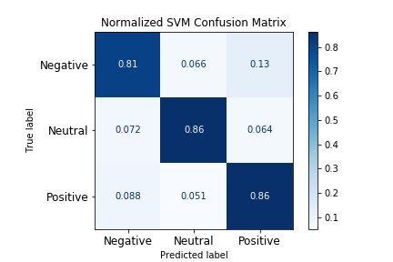

# Sentiment Analysis: Covid Vaccine on Twitter
**Author**: [David Bruce](mailto:david.bruce14@gmail.com)

Image source: Unsplash

## Overview
In late January 2020, the first known case of the novel Coronavirus was documented in the United States, and on December 14th of the same year, an FDA emergency approved vaccine produced by pharmaceuticals manufacturer Pfizer was given to its first non-trial patient, a healthcare worker in New York. The vaccine was created in record time, less than a year after the discovery of the virus, and after the deaths of over 300,000 Americans, and over 1,000,000 worldwide. However, the world seems divided into those who are ready to receive the inoculation, and those who aren't. According to the CDC, the amount of people who need protection from a specific disease varies by disease, and the New York Times states "Public health officials estimate that 70 to 75 percent of the population needs to be vaccinated before people can start moving freely in society again" ([NY Times](https://www.nytimes.com/2020/12/14/well/live/covid-vaccine-questions.html#link-4355ea14)). And in the United States, the most recent Gallup poll released November 17th suggests that still only 58% of Americans say they would take a COVID-19 vaccine [Gallup](https://news.gallup.com/poll/325208/americans-willing-covid-vaccine.aspx). 

While vaccines and vaccinations have been a hotly debated political topic for many in the US, diving into the realm of medical freedoms and the measures available to a government in order to protect its citizens from public health concerns, none have been as widespread and polarized as COVID-19. So when a global pandemic and a record breaking vaccine occur in the same year as one of the country's most contentious and hotly debated presidential elections, sentiments are sure to be high, and not least of all on Twitter. What is at the core of this divide? And how might government officials and medical professionals be able to address the lack of faith in a vaccine in the current cultural moment? These are the questions I hope to address with natural language processing (NLP) and machine learning classification algorithms.

## Business Problem

Using the data available from Twitter, I wanted to use NLP techniques to analyze tweet sentiment and help find insights as to how people are feeling about a COVID-19 vaccine. Sentiment analysis is a difficult task for machines to perform because there are many hurdles to overcome. Even when a text is being classified by humans as positive, negative, or neutral in sentiment, there is a significant amount of subjectivity and nuance that goes into that judgment on top of years of communicating as a human. Linguists and data scientists have made incredible progress in the realm of NLP in the last decade, and still sentiment analysis proves full of unique challenges. It is difficult to train a machine to detect sarcasm or cultural differences when speaking the same language. This should not deter us from trying, and in my case I want to classify tweets about COVID-19 from the last 10 months as either positive, negative, or neutral in their sentiment, and perhaps more importantly learn what is distinct about the language of each of these classes.

## Data & Methods

Twint, VADER, Python, SpaCy, NLTK, Scikit Learn

## Modeling

Modeling with text based data first requires one to vectorize the words in their corpus of any significance (i.e. no unnecessary stop words). In my case I used the term frequency - interdocument frequency (tfidf) to vectorize my corpus. Once vectorized and split into train and test data, I set the target to be the sentiment category (positive, negative, neutral). This meant I was aiming to perform a *multiclass* classification. 

I chose to evaluate my models on their F1 scores as this strikes a good balance between precision and recall, and a model cannot produce a good F1 score without being strong in both. From my perspective there were no significant risks in overcompensating for misclassifying tweets as either positive, negative, or neutral, so evaluating on the F1 accounted for all angles.

I chose to begin my modeling process with a simple multinomial naive bayes because there are very few hyperparameters to tune and it known to work exceptionally well with text classification. I progressively increased the complexity of my vanilla models moving from naive bayes to support vector machine (SVM) to RandomForest. 

 

Compared to the naive bayes classifier above, the SVM does a much better job at classifying the neutral class. This is the kind of coloring we like to see in a confusion matrix with a solid dark line through the diagonal indicating that the model predicted a tweet's true class accurately. 

 

And finally I tried using an ensemble method with my RandomForest classifier, which did not produce good results. We can see from the confusion matrix below the dark blue heaviness over the predicted positive class, this means the classifier was disposed to choosing the positive class (the most prevalent class in the dataset).

After evaluating each of these models, the choice was clear, SVM won the day, and in the end I would like to come back and improve upon this model.

## Recommendations

Based on the results of my analysis, I would recommend gathering even more data and passing new tweets through my SVM classifier to keep gaining deeper insights into what is preventing individuals from trusting an FDA approved vaccine for the Coronavirus.

The insights I gained from the exploratory data analysis phase lead me to believe that people who posted negative tweets about the covid vaccine are more likely to...

## Next Steps

**With more time I would like to:**
1) Incorporate more tweets from more consistent dates and specified by location and do an analysis across different locales
2) Continue to add incoming tweets from more recent dates especially since the vaccine was first administered to the public right after my webscraping
3) Perform Latent Dirichlet Allocation (LDA) topic modeling to gain further insight into the data
4) Develop and write a more specialized, custom tailored text preprocessing function, vast improvements can be made in this area
5) Dive deeper into hyperparameter tuning with each of the models, there is bound to be improvements
6) Explore NLP and sentiment analysis on tweets in languages other than English

## Repository Contents
-`data`: Folder contains data used in notebooks, mostly hidden in .gitignore due to file sizes
-`images`: Folder contains graphs from EDA & modeling process and other graphics
-`src`: Folder contains .py file
-`.gitignore`: Contains hidden files including the original dataset
-`01_web_scraping.ipynb`: Jupyter notebook where tweets are scraped 
-`02_cleaning.ipynb`: Jupyter notebook used for data cleaning
-`03_EDA.ipynb`: Jupyter notebook for exploratory data analysis
-`04_modeling.ipynb`: Jupyter notebook for modeling and results
-`presentation.pdf`: Image of slide deck
